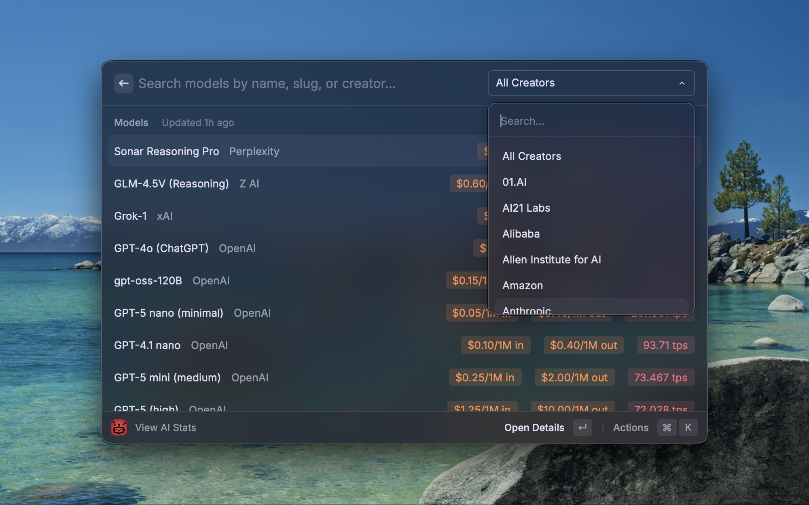
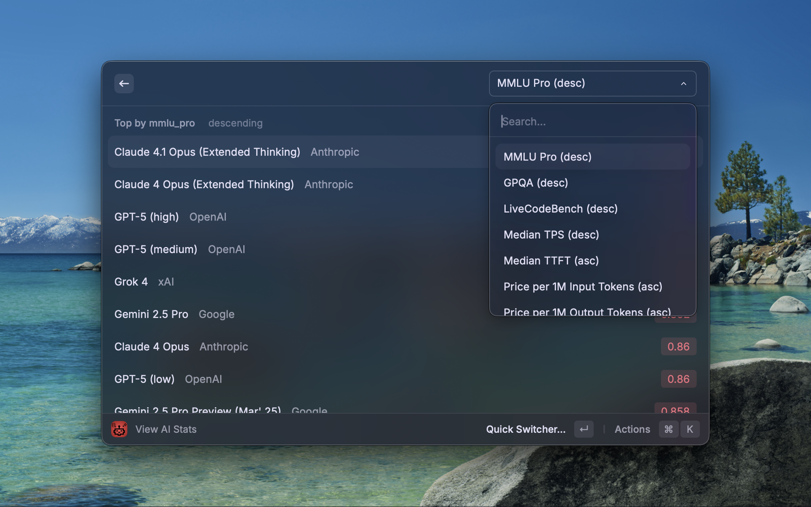

# AI-Stats (Raycast Extension)

A Raycast extension that provides quick access to AI model statistics and leaderboards.
It connects to a Supabase database (hosted by Jonathan Reed) that syncs with [ArtificialAnalysis.ai](https://artificialanalysis.ai/).
Search models, view benchmark results, compare prices, and check leaderboards — all without leaving Raycast.

🌐 Web version: [https://aistats.jonathanreed.com](https://aistats.jonathanreed.com)

## Screenshots

## Usage

- Command: `View AI Stats`
- Creator Filter: Cmd+P
- Reset Filters: Cmd+Backspace
- Pinned Models: Pin/Unpin from list or detail; Move Up/Down; optional Pinned section in preferences.

## Features

- 🔍 **Search Models** – Find models by name, slug, or creator. Most recent models shown first.
- 🏷️ **Price Badges** – input & output prices per 1M tokens at a glance.
- 🚀 **Throughput** – Median tokens/sec and TTFT, with clear color cues.
- 🏆 **Leaderboards** – Rank by MMLU, GPQA, TPS, TTFT, prices, and more.
- 📄 **Model Detail Pages** – “About” pages with overview, pricing, throughput, benchmarks, and raw JSON.
- 📌 **Pin a Model** – Pin upto 10 models and have them in the top of the list when the extension launches.

## Setup

1. Install the extension in Raycast
2. Run the command: `View AI Stats`
   - Use the search list and Action menu (or Cmd+K) to switch to leaderboards.

## Data Source

- 📡 Stats come from [ArtificialAnalysis.ai](https://artificialanalysis.ai/) (via their free API).
- Data and benchmarks are owned by ArtificialAnalysis.com. But hosted by a supabase database to reduced API calls.

## License

MIT License

## Disclaimer

This is a hobbyist project. Data is owned by ArtificialAnalysis.com.
The Supabase database is hosted and maintained by Jonathan Reed.
